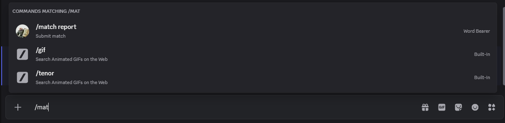

# Ladder Leagues

Ladder leagues are a league format that allows for drop-in play instead of weekly pairings. It aims to reward those who play consistently without punishing people who can only play infrequently. Players earn points via completing activities, and the winners are those with the most points at the end of the league. Additional prizes may be awarded for other conditions.

## How do I participate?

Just show up! Post in the relevant discord channel for your game to schedule games with fellow league players. Game days will be scheduled to make this a bit easier, but you can play whenever and wherever. After you finish playing, submit your match according to the league instructions and your score will be updated automatically.

## Submitting Scores

To submit your scores, you can use the `Word Bearer` bot in the Xepher Arcade discord. To submit your scores, start typing `/match report` and you should see the command appear above your chat bar. Press enter to send the message and you'll be greeted with a pop-up that will prompt you for information about the league. Enter the information that corresponds to your match and press submit, your scores will be recorded.

## Scoring Rubric

If an activity is listed as time restricted, that means points can only be awarded once per time period in the league. Typically, this a week.

| Activity                                   | Points Awarded                         | Time Restricted |
| ------------------------------------------ | -------------------------------------- | --------------- |
| Play a match                               | 1                                      | Yes             |
| Win a match                                | 1                                      | Yes             |
| Play against a new opponent                | 1                                      | No              |
| Beat an opponent with more points than you | `(opponentsPoints - yourPoints) * 0.5` | Yes             |

